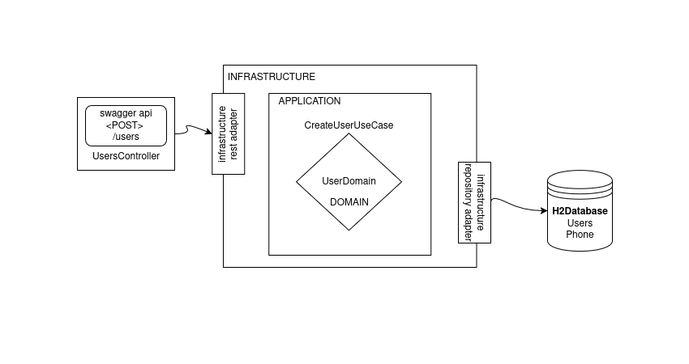

# Ejercicio Java - Arquitectura de servicio



# Ejercicio Java - API de Usuarios

API REST para registro de usuarios desarrollada con Spring Boot y base de datos H2 en memoria.

## 🚀 Cómo ejecutar en local

### Clonar el repositorio
```bash
git clone https://github.com/onava006/ejercicio-java.git
```

### Navegar al directorio del proyecto
```bash
cd ejercicio-java
```

### Verificar la versión de Gradle
```bash
./gradlew -v
```

### Limpiar y construir el proyecto
```bash
./gradlew clean build
```

### Ejecutar la aplicación
```bash
java -jar build/libs/ejerciciojava-0.0.1-SNAPSHOT.jar
```

## 🗄️ Base de Datos

### Acceder a la consola H2
Para revisar el estado de la base de datos y verificar los registros:
```
http://localhost:8080/h2-console/
```

### Configuración de conexión H2
En el formulario de conexión, usar los siguientes valores:
- **Driver Class:** `org.h2.Driver`
- **JDBC URL:** `jdbc:h2:mem:userdb`
- **User Name:** `sa`
- **Password:** `sa`

## 🧪 Pruebas de la API

### Caso 1: Registro exitoso de usuario
```bash
curl -X POST "http://localhost:8080/users" \
  -H "Content-Type: application/json" \
  -d '{
    "name": "Juan Rodriguez",
    "email": "juan@rodriguez.org",
    "password": "hunter2",
    "phones": [
      {
        "number": "1234567",
        "citycode": "1",
        "countrycode": "57"
      }
    ]
  }'
```

### Caso 2: Usuario con múltiples teléfonos
```bash
curl -X POST "http://localhost:8080/users" \
  -H "Content-Type: application/json" \
  -d '{
  "name": "Carlos Navarro",
  "email": "carlos@navarro.org",
  "password": "wellsfargo2",
  "phones": [
    {
      "number": "7654321",
      "citycode": "2",
      "countrycode": "58"
    },
    {
      "number": "1234567",
      "citycode": "1",
      "countrycode": "57"
    }
  ]
}'
```

### Caso 3: Error por email duplicado
```bash
curl -X POST "http://localhost:8080/users" \
  -H "Content-Type: application/json" \
  -d '{
    "name": "Otro Juan Rodriguez",
    "email": "juan@rodriguez.org",
    "password": "hunter2",
    "phones": [
      {
        "number": "4342342",
        "citycode": "3",
        "countrycode": "59"
      }
    ]
  }'
```

### Caso 4: Error por email inválido
```bash
curl -X POST "http://localhost:8080/users" \
  -H "Content-Type: application/json" \
  -d '{
    "name": "Hernando Pereira",
    "email": "malformedmail.org",
    "password": "blabla",
    "phones": [
      {
        "number": "123124",
        "citycode": "32",
        "countrycode": "60"
      }
    ]
  }'
```

## 📋 Prerrequisitos

- Java 11 o superior
- Gradle
- curl (para pruebas desde terminal)
- Sistema operativo: Linux, macOS o Windows con WSL

## 📚 Notas

- La aplicación usa una base de datos H2 en memoria
- Los datos se reinician cada vez que se detiene la aplicación
- Ejecutar los casos de prueba en el orden sugerido para validar las funcionalidades correctamente
